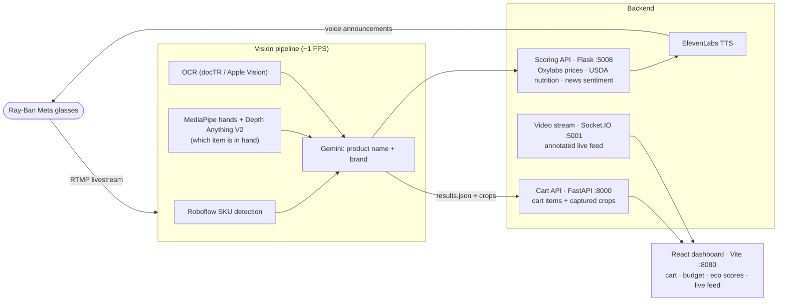

# Cartify

**Shop smart. Spend wisely. Live sustainably.**

Built in 36 hours at HackHarvard 2025.

Cartify turns Ray-Ban Meta smart glasses into a real-time shopping assistant. As you walk through a store, the glasses' live video feed is analyzed to recognize the products you pick up and add them to a virtual cart — then Cartify compares prices against online listings, scores each item's sustainability, tracks your budget, and reads the results back to you through the glasses' speakers.

## Architecture



The flow: the glasses livestream to an RTMP endpoint (a webcam or recorded video works too). Frames are processed at ~1 FPS — Roboflow finds products, hand tracking plus depth estimation pick out the item you're actually holding, OCR reads the packaging, and Gemini resolves it all to a product name and brand. The backend then prices the product on Google Shopping, pulls USDA nutrition data and news sentiment, and rolls everything into a sustainability score. ElevenLabs announces prices and eco-scores through the glasses while the dashboard shows the cart, budget, and annotated feed live.

## Repo layout

| Path | What it is |
|---|---|
| `vision_backends/` | CV pipeline — detection, hands, depth, OCR, Gemini extraction. `video_product_pipeline.py` runs it over a video. |
| `backend/` | Scoring engine and APIs — price scraping, nutrition, sentiment, Ray-Ban TTS endpoints. |
| `frontend/` | React dashboard — landing page, live feed, cart, budget, sustainability cards. |
| `models/` | Depth Anything V2 Small (Core ML). |

## Running it

**Backend** — create a venv, `pip install -r requirements.txt`, then put your own keys in `backend/.env`:

```bash
OXYLABS_USERNAME=...      # Google Shopping scraping
OXYLABS_PASSWORD=...
GEMINI_API_KEY=...        # product extraction + analysis
NEWS_API_KEY=...          # news sentiment
USDA_API_KEY=...          # nutrition data
ELEVENLABS_API_KEY=...    # text-to-speech
ELEVENLABS_VOICE_ID=...
```

```bash
python3 backend/start_api.py            # scoring API on :5008
python3 backend/shopping_cart_api.py    # cart API on :8000
python3 backend/video_stream_server.py  # annotated video feed on :5001
```

**Vision** — `python3 vision_backends/start_vision_app.py` for live RTMP/camera ingest, or run the full pipeline over a recording with `python3 vision_backends/video_product_pipeline.py path/to/video.mp4`.

**Frontend** — `cd frontend && npm install && npm run dev`. Set `VITE_BACKEND_URL` if the cart API isn't on `http://localhost:8000`.

Endpoint details live in `backend/README.md` and `backend/RAY_BANS_SETUP_GUIDE.md`.

## Notes

This is a hackathon build — expect rough edges. Model weights are checked into the repo, the services assume localhost, and several files in `vision_backends/` are alternative experiments rather than parts of the final pipeline.
