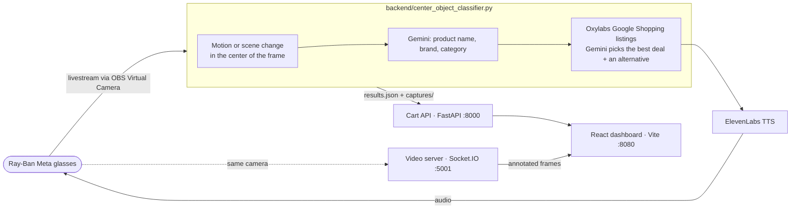

# Cartify

**Shop smart. Spend wisely. Live sustainably.**

A shopping assistant for Ray-Ban Meta smart glasses, built by a team of four at HackHarvard 2025. You pick up a product in a store, Cartify works out what it is, looks up what it costs online, adds it to a cart that tracks your budget, and tells you out loud where it's cheaper.

I worked on the backend: Oxylabs price scraping, the sustainability scoring API (USDA nutrition data and news sentiment), and the ElevenLabs text-to-speech.

## How it works


```mermaid
flowchart LR
    G(["Ray-Ban Meta glasses"])
    subgraph CLS["backend/center_object_classifier.py"]
        direction TB
        TRIG["Motion or scene change<br/>in the center of the frame"] --> GEM["Gemini: product name, brand, category"]
        GEM --> DEAL["Oxylabs Google Shopping listings<br/>Gemini picks the best deal + an alternative"]
    end
    G -- "livestream via OBS Virtual Camera" --> CLS
    DEAL --> TTS["ElevenLabs TTS"]
    TTS -- "audio" --> G
    CLS -- "results.json + captures/" --> CART["Cart API · FastAPI :8000"]
    CART --> FE["React dashboard · Vite :8080"]
    G -. "same camera" .-> VS["Video server · Socket.IO :5001"]
    VS -- "annotated frames" --> FE
```

The glasses' livestream reaches the laptop as a camera device (OBS Virtual Camera; `find_cameras.py` prints the indices). When something new shows up in the middle of the frame, the classifier saves a crop, asks Gemini what it is, pulls Google Shopping listings through Oxylabs, and has Gemini turn them into a best deal plus one alternative, which gets spoken with ElevenLabs. The cart goes into `results.json`, and the dashboard polls it through the cart API every two seconds to show items, spend against your budget, and eco scores next to the live feed.

Two pieces sit outside that loop. `backend/start_api.py` is the sustainability scoring API on :5008 (Oxylabs prices, USDA nutrition, news sentiment, Gemini), and `vision_backends/video_product_pipeline.py` is a heavier pipeline for recorded video: Roboflow SKU detection, MediaPipe hands and Depth Anything V2 to find the item in your hand, Apple Vision OCR, and Gemini, at 1 frame per second.

## Running it

macOS only (Core ML, Apple Vision and `afplay`). `pip install -r requirements.txt`, then put your keys in `backend/.env`:

```bash
GEMINI_API_KEY=...
OXYLABS_USERNAME=...      # Google Shopping via Oxylabs
OXYLABS_PASSWORD=...
ELEVENLABS_API_KEY=...
ELEVENLABS_VOICE_ID=...
NEWS_API_KEY=...          # scoring API only
USDA_API_KEY=...          # scoring API only
```

```bash
cd backend
python3 center_object_classifier.py --camera 1 --tts   # or pass a video file path
python3 shopping_cart_api.py                           # cart API on :8000
python3 video_stream_server.py                         # live feed on :5001 (CAMERA_ID is set in the file)
python3 start_api.py                                   # scoring API on :5008, optional
```

Dashboard: `cd frontend && npm install && npm run dev`. Set `VITE_BACKEND_URL` if the cart API isn't on `http://localhost:8000`.

The recorded-video pipeline also needs `ROBOFLOW_API_KEY` in the environment and `models/DepthAnythingV2SmallF16.mlpackage` (Apple's Core ML build of Depth Anything V2 Small, on Hugging Face), which isn't checked in. Run it from the repo root with `python3 vision_backends/video_product_pipeline.py path/to/video.mp4`.

## Notes

This is a hackathon build. Everything assumes localhost, and much of `vision_backends/` is earlier experiments. For the demo, the deal text for Pringles and Coca-Cola and the dashboard's eco scores are hardcoded rather than looked up live. Endpoint details are in `backend/README.md` and `backend/RAY_BANS_SETUP_GUIDE.md`.
